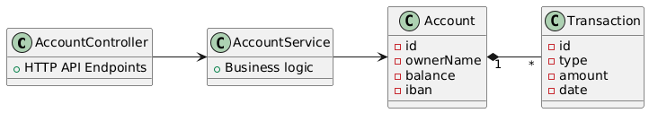

# NovaBank - Qaracter Academy
### By Guzman G Riancho
## 1.

a.
A REST API lets you talk to the server using HTTP urls, the most basic functionalities are the CRUD methods, create, read, update, or delete.
Its good for a bank beacause it lets them have all the data being accesed from various apps/webs and its all consistent.

**b. JPA & Raw SQL**
JPA  translates java classes into database tables
Using raw SQL puts you in danger of being attacked by SQL Injections and other attacks

## 2.
The project is divided into the following packages

- Controller - Handles the url HTTP requests
- Exception - Has a global handler for all custom exceptions
- Model - Basic object classes with JPA anotations and DTOs
- Repository - Interacts with the database with default methods
- Service - Business logic

## 3.

## 4. Technical Decisions
- Added account to the transaction class to be able to declare the connection correctly.
- The app was printing infinite transactions due to them referencing the account object and viceversa, and by adding @JSONIgnore I avoided that error
- I implemented the object class with the JPA annotations directly instead of making an entity package for simplicity and because I have been working in this format and I felt more comfortable.